<div align="center">

# Anatomi 3D

**Windows için profesyonel, etkileşimli tam vücut 3D anatomi atlası**

~2.950 anatomik yapı · gerçek zamanlı fiziksel tabanlı görüntüleme · Türkçe bilgi bankası · katman katman diseksiyon

[](https://github.com/EthYusuf/anatomi-3d/releases/latest)


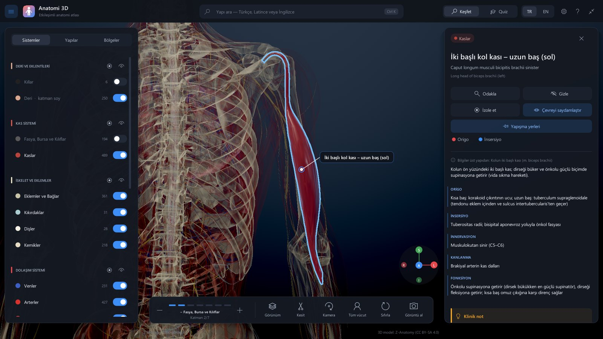

**[⬇ Windows için indir](https://github.com/EthYusuf/anatomi-3d/releases/latest)** ·
[Özellikler](#öne-çıkanlar) · [Ekran görüntüleri](#ekran-görüntüleri) · [Kaynak koddan derleme](#kaynak-koddan-derleme) · [Mimari](#mimari)

</div>

---

## İçindekiler

- [Öne çıkanlar](#öne-çıkanlar)
- [Ekran görüntüleri](#ekran-görüntüleri)
- [İndirme ve sistem gereksinimleri](#i̇ndirme-ve-sistem-gereksinimleri)
- [Kullanım ve kısayollar](#kullanım-ve-kısayollar)
- [Kaynak koddan derleme](#kaynak-koddan-derleme)
- [Mimari](#mimari)
- [Türkçe bilgi bankası](#türkçe-bilgi-bankası)
- [Model paketini yeniden üretme](#model-paketini-yeniden-üretme)
- [Performans](#performans)
- [Proje yapısı](#proje-yapısı)
- [Web sürümü (v1)](#web-sürümü-v1)
- [Yol haritası](#yol-haritası)
- [Lisans ve kaynaklar](#lisans-ve-kaynaklar)

## Öne çıkanlar

| | |
|---|---|
| 🧍 **Tam vücut** | İskelet, kaslar, eklem ve bağlar, arter ve venler, kalp, periferik sinirler, beyin ve omurilik, duyu organları, iç organlar ve deri bölgeleri — sağ/sol ayrı ~2.950 yapı |
| 🎨 **Gerçekçi görüntüleme** | Fiziksel tabanlı (PBR) malzemeler, deri için alt yüzey saçılımı yaklaşımı, yumuşak gölgeler, ortam kapatması (SSAO), 4× MSAA, uyarlamalı teselasyon; kas lifleri, kemik gözenekleri ve deri dokusu doku dosyası olmadan shader içinde üretilir |
| 🇹🇷 **Türkçe bilgi bankası** | Yapıların %99,9'u Türkçe adlı. Kemiklerin ve kasların tamamı, kalp, akciğerler, sindirim, üriner, genital ve endokrin sistem ile duyu organları için özet, origo, insersiyo, innervasyon, kanlanma, fonksiyon ve klinik notlar |
| 📍 **Kas yapışma yerleri** | Bir kas seçildiğinde kemik üzerindeki origo (kırmızı) ve insersiyo (mavi) alanları gösterilir |
| 🔬 **Diseksiyon araçları** | Çift tıklayarak yapıyı kaldırma, katman katman soyma, X-ray, tel kafes, üç eksende kesit (kesit yüzeyleri dolu), izole etme, çevreyi saydamlaştırma |
| 🔎 **Üç dilde arama** | Türkçe, Latince ve İngilizce; Türkçe karakter ve büyük/küçük harf duyarsız, eş anlamlı terimlerle |
| 🧭 **Gezinme** | Sistemler, hiyerarşik yapı ağacı ve 23 hazır bölge (kafatası, kalp, beyin, göz, kulak…); yön göstergesi ve kamera ön ayarları |
| 🎓 **Quiz modu** | Görünen yapılar arasından "modelde bulun" soruları, puan ve seri |
| ⚡ **Akıcı** | GTX 1050 sınıfı bir ekran kartında 1080p ve 4× MSAA ile 60 fps; kalite ekran kartına göre otomatik seçilir |

## Ekran görüntüleri

<table>
<tr>
<td width="50%">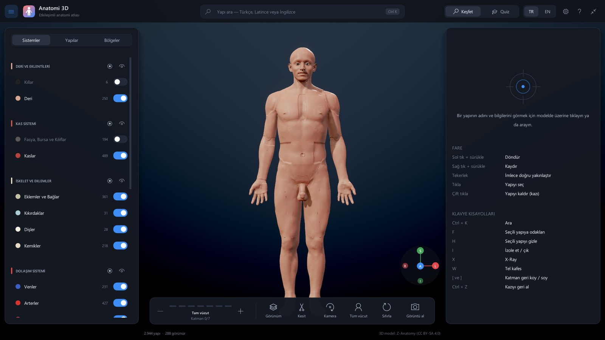<br><sub>Açılış görünümü: sistem ve kategori filtreleri, kısayol yardımı, alt araç çubuğu.</sub></td>
<td width="50%">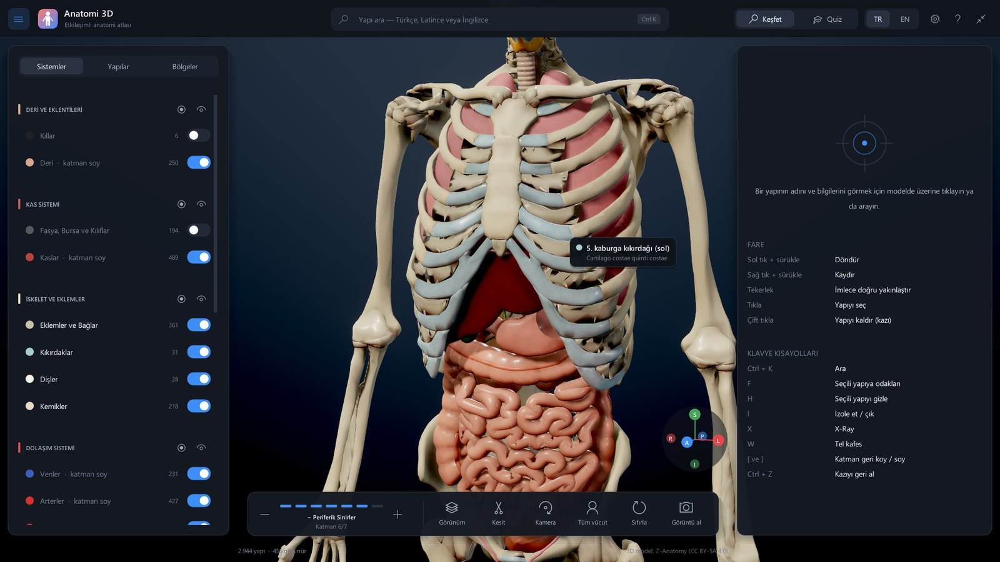<br><sub>Katman soyma ile göğüs kafesi, akciğerler, karaciğer, mide ve bağırsaklar; üzerine gelince etiket.</sub></td>
</tr>
<tr>
<td>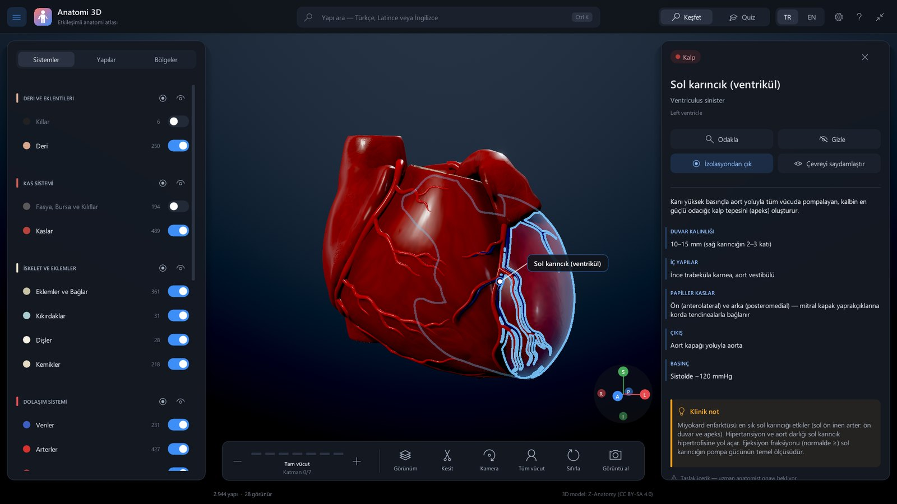<br><sub>Hazır "Kalp" bölgesi ve sol karıncığın Türkçe bilgi kartı.</sub></td>
<td>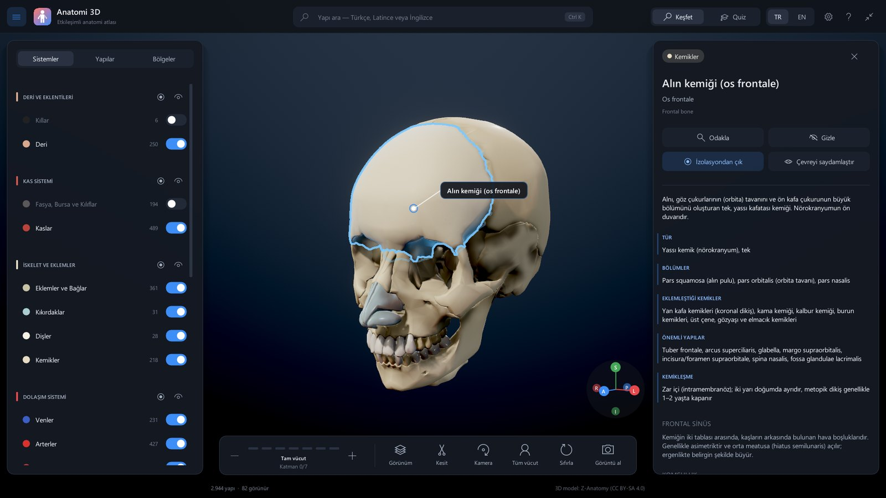<br><sub>Kafatası bölgesi: alın kemiğinin bölümleri, eklemleri, önemli yapıları ve klinik notu.</sub></td>
</tr>
<tr>
<td>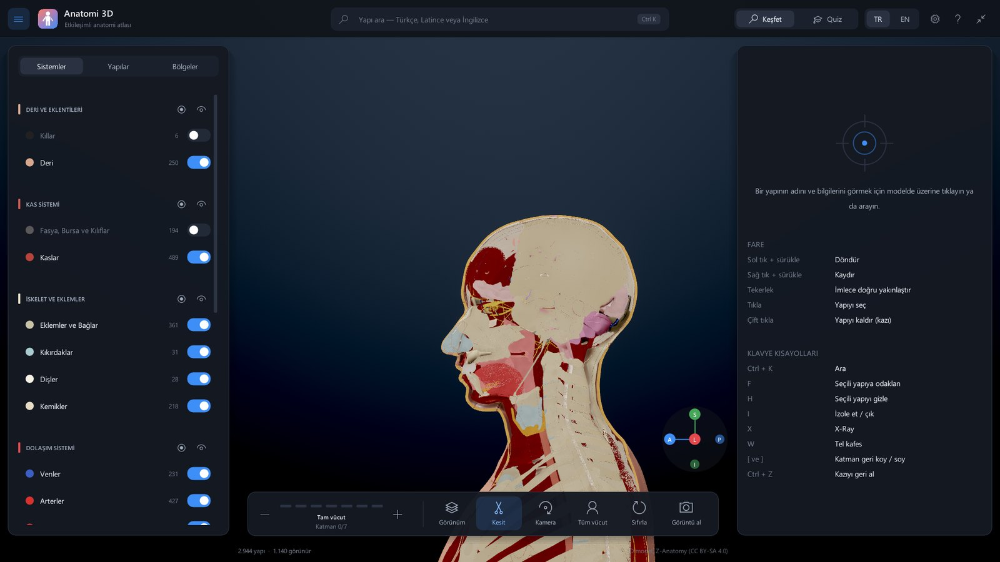<br><sub>Sagittal kesit: kesit yüzeyleri kategoriye göre dolu çizilir.</sub></td>
<td>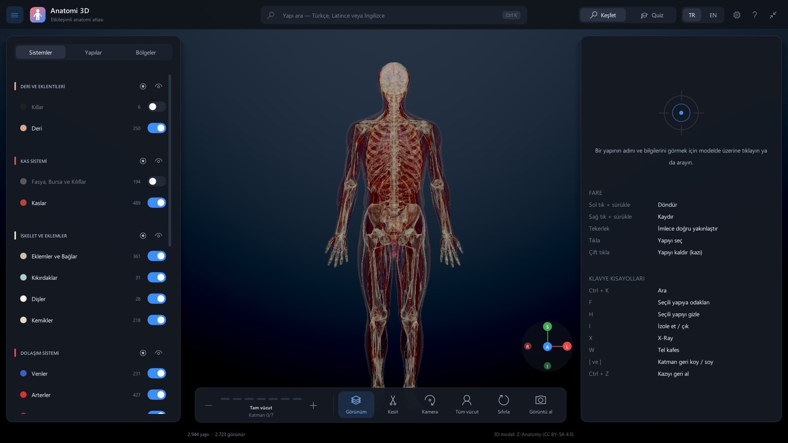<br><sub>X-ray modu (sıra bağımsız saydamlık).</sub></td>
</tr>
<tr>
<td>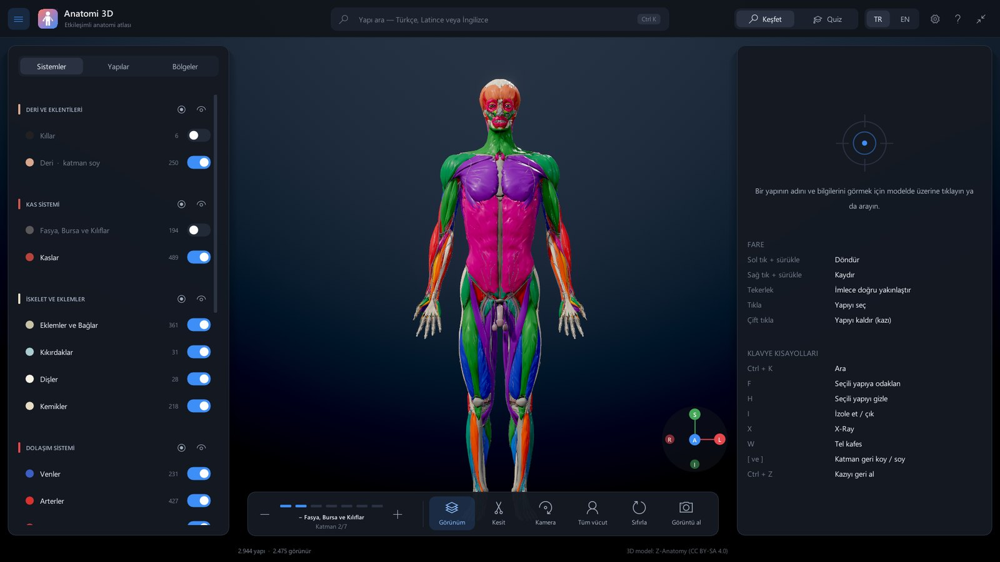<br><sub>Kas fonksiyonu renklendirmesi: fleksiyon, ekstansiyon, abdüksiyon, addüksiyon, rotasyon…</sub></td>
<td>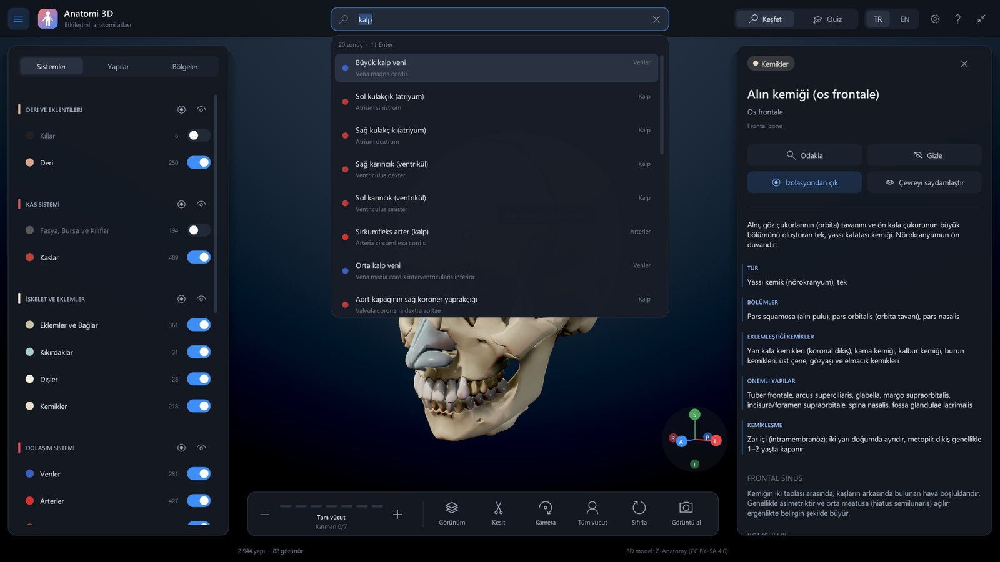<br><sub>Türkçe arama: "kalp" yazınca kulakçıklar, karıncıklar ve kalp damarları listelenir.</sub></td>
</tr>
</table>

## İndirme ve sistem gereksinimleri

1. [Sürümler sayfasından](https://github.com/EthYusuf/anatomi-3d/releases/latest) `Anatomi3D-<sürüm>-win-x64.zip` dosyasını indirin.
2. Zip'i bir klasöre çıkarın ve `Anatomi3D.exe`'yi çalıştırın. Kurulum gerekmez; .NET çalışma zamanı pakete dahildir.

> Uygulama henüz dijital olarak imzalı olmadığından Windows SmartScreen uyarı gösterebilir: **Ek bilgi → Yine de çalıştır**.

| | Gereksinim |
|---|---|
| İşletim sistemi | Windows 10 veya 11, 64 bit |
| Ekran kartı | DirectX 11 (özellik düzeyi 11.0) destekli; harici ekran kartı önerilir |
| Disk | ~250 MB |

Birden fazla ekran kartı olan dizüstü bilgisayarlarda uygulama harici kartı kendiliğinden seçer; tümleşik kartı zorlamak için `Anatomi3D.exe --gpu integrated`.

## Kullanım ve kısayollar

| Eylem | Fare | Klavye |
|---|---|---|
| Döndür / kaydır / yakınlaştır | Sol sürükle / sağ sürükle (veya `Shift` + sürükle) / tekerlek | — |
| Seç ve bilgi kartını aç | Tıkla | `Esc` seçimi kaldırır |
| **Yapıyı kaldır (kazı)** | **Çift tıkla** | `Ctrl+Z` geri al · `Ctrl+Shift+Z` tümünü geri getir |
| Odakla | Bilgi kartında **Odakla** | `F` |
| Gizle / izole et | Bilgi kartı | `H` / `I` |
| Tümünü göster | — | `U` |
| Katman soy / geri koy | Alt çubuktaki `−` `+` | `]` / `[` |
| X-ray / tel kafes | Görünüm menüsü | `X` / `W` |
| Ara | Üstteki arama kutusu | `Ctrl+K` |
| Kamera: ön, arka, sol, sağ, üst, izometrik | Kamera menüsü | `1` … `6` · `Home` başlangıç |
| Tam ekran / ekran görüntüsü | — | `F11` / `F12` (Resimler\Anatomi 3D) |

Ayarlar penceresinden görüntü kalitesi (Otomatik, Ultra, Yüksek, Orta, Düşük; ayrıca MSAA, gölgeler, SSAO, bloom ve teselasyon tek tek), dil (Türkçe/İngilizce) ve arayüz ölçeği değiştirilebilir.

## Kaynak koddan derleme

Gereksinimler: Windows 10/11 x64, [.NET 8 SDK](https://dotnet.microsoft.com/download/dotnet/8.0) ve Git.

```powershell
git clone https://github.com/EthYusuf/anatomi-3d.git
cd anatomi-3d
powershell -ExecutionPolicy Bypass -File tools\veri-indir.ps1   # model paketini indirir (~63 MB)
dotnet run --project src/Anatomi3D.Desktop -c Release
```

Model paketi (`data/anatomy.pak`) boyutu nedeniyle Git deposunda değil, [sürümlerde](https://github.com/EthYusuf/anatomi-3d/releases) yayınlanır; betik paketi indirip SHA-256 ile doğrular. `data/` klasörü derleme sırasında çıktı klasörüne kopyalanır, bu yüzden `data/content/` altındaki bilgi dosyalarını değiştirdikten sonra yeniden derleyin.

Tek klasörde çalışan (bağımsız) paket üretmek için:

```powershell
dotnet publish src/Anatomi3D.Desktop -c Release -r win-x64 --self-contained -o artifacts/Anatomi3D
```

<details>
<summary><b>Komut satırı seçenekleri</b></summary>

| Seçenek | Açıklama |
|---|---|
| `--gpu integrated` | Tümleşik ekran kartını kullan (varsayılan: harici) |
| `--windowed`, `--size 1600x900` | Pencere kipinde ve verilen boyutta aç |
| `--no-intro` | Açılış animasyonunu atla |
| `--data <klasör>` | Model paketi ve içerik klasörü |
| `--content-report <dosya.tsv>` | Grafik başlatmadan içerik kapsama raporu üret (aşağıya bakın) |
| `--script "<komutlar>"`, `--script-file <dosya>` | Otomasyon: kamera, seçim, katman, kesit ve ekran görüntüsü komutları (`;` ile ayrılır); görsel testler ve belge görselleri için kullanılır, kullanıcı ayarlarını değiştirmez |

</details>

## Mimari

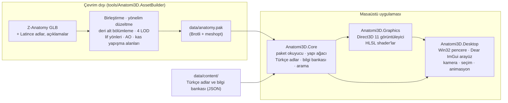

| Proje | Sorumluluk |
|---|---|
| `src/Anatomi3D.Core` | `A3DPAK01` paket biçimi ve paralel çözücü (Brotli + meshopt), yapı ve grup hiyerarşisi, kategori/sistem tanımları, Türkçe ad sözlüğü, bilgi bankası ve kalıtım kuralları, Türkçe duyarlı arama dizini |
| `src/Anatomi3D.Graphics` | Direct3D 11 cihazı (harici GPU seçimi), görüntüleme hattı, çalışma anında derlenip önbelleğe alınan HLSL shader'lar, GPU zaman ölçümü |
| `src/Anatomi3D.Desktop` | Win32 pencere ve giriş, Dear ImGui tabanlı arayüz (paneller, arama, bilgi kartı, quiz, ayarlar), yörünge kamera, sahne animasyonları, betik otomasyonu |
| `tools/Anatomi3D.AssetBuilder` | Z-Anatomy kaynak modellerinden `anatomy.pak` üretimi |

**Görüntüleme hattı:** gölge haritası → MSAA ön geçiş (normal + yapı kimliği) → derinlik çözümleme → yarım çözünürlükte SAO ortam kapatması + iki yönlü bulanıklaştırma → uyarlamalı Phong teselasyonlu ileri PBR geçişi (GGX, clearcoat, sheen, sarmalanmış yayınık aydınlatmayla (wrap lighting) deri saçılımı yaklaşımı, küresel harmonik + önfiltrelenmiş ortam ışığı) → X-ray için ağırlıklı karışımlı sıra bağımsız saydamlık → ton eşlemeli MSAA çözümleme → bloom → ACES → yapı kimliğinden seçim çerçevesi → arayüz. Seçim GPU'da kimlik tamponundan okunur; ayrıntı düzeyi ekran uzayı hatasına göre seçilir, görüş alanı dışındaki yapılar elenir ve çizim çağrıları birleştirilir.

## Türkçe bilgi bankası

Türkçe içerik kod değiştirmeden düzenlenebilen JSON dosyalarında tutulur:

- `data/content/names*.tr.json` — ~1.670 yapının ve ~360 grubun Türkçe adları
- `data/content/tr/*.json` — bilgi girdileri (379 girdi, 584 yapıyı kapsar)

```json
"Biceps brachii muscle": {
  "grup": true,
  "tr": "Kolun iki başlı kası (m. biceps brachii)",
  "ozet": "Kolun ön yüzündeki iki başlı kas; …",
  "bilgi": [["Origo", "…"], ["İnsersiyo", "…"], ["İnnervasyon", "…"], ["Kanlanma", "…"], ["Fonksiyon", "…"]],
  "bolumler": [{ "baslik": "…", "metin": "…" }],
  "klinik": "…",
  "durum": "taslak"
}
```

Anahtarlar modeldeki İngilizce yapı adlarıdır. Kendi girdisi olmayan bir yapı, sırasıyla kas başı/bölümünden taban kasa (ör. *Long head of biceps brachii* → *Biceps brachii muscle*), sistematik ad kurallarına (ör. *Vertebra T7* → *Thoracic vertebrae*), üst yapısına ve `"grup": true` olan grup girdilerine bakarak bilgi kalıtır; bilgi kartında bu durum belirtilir.

Kapsama raporu hangi yapıların bilgisiz kaldığını ve hiçbir yapıyla eşleşmeyen (büyük olasılıkla yanlış yazılmış) anahtarları listeler:

```powershell
Anatomi3D.exe --content-report rapor.tsv
```

| Kapsam | Durum |
|---|---|
| Kemikler, dişler, kaslar | Tamamı |
| Kalp, solunum, sindirim, üriner, genital, endokrin sistem, periton ve plevra, duyu organları, beyin zarları | Tamamı |
| Eklemler ve bağlar, kıkırdaklar | Kısmen |
| Beyin ve omurilik, periferik sinirler, arter ve venler, fasyalar, deri bölgeleri | Planlanıyor ([yol haritası](#yol-haritası)) |

> Bilgi girdileri **taslak** durumundadır ve klinik kullanımdan önce uzman gözden geçirmesi gerektirir; uygulama bunu kartta belirtir. Yapıların çoğunda ayrıca İngilizce Wikipedia açıklaması gösterilir.

## Model paketini yeniden üretme

Hazır paket sürümlerde yayınlandığı için bu adım yalnızca modeli değiştirmek istiyorsanız gerekir.

1. Z-Anatomy FBX modellerini [Z-Anatomy deposundan](https://github.com/LluisV/Z-Anatomy/tree/PC-Version/Resources/Models/FBX) indirip GLB'ye çevirin ve `_raw/za/` altına koyun; depodaki `Resources/` klasörünü `_raw/za_repo/Resources/` olarak ekleyin.
2. Paketi üretin (~2,5 dakika):

```powershell
dotnet run -c Release --project tools/Anatomi3D.AssetBuilder
```

Derleyici etiket ve işaret düğümlerini ayıklar, yapıları dünya koordinatlarında birleştirip yönelimlerini düzeltir, deriyi tek parça hâlinde dikişsiz birleştirip interpolasyonlu Loop alt bölümlemesiyle inceltir (~114 bin → ~1,83 milyon üçgen), her yapı için dört ayrıntı düzeyi, kas lif yönleri, ortam kapatması ve kas yapışma alanlarını üretir ve sonucu 16 baytlık nicemlenmiş köşelerle sıkıştırarak `data/anatomy.pak` dosyasına yazar.

## Performans

GeForce GTX 1050, 1920×1080, 4× MSAA, Yüksek kalite (GPU kare süresi):

| Görünüm | GPU süresi |
|---|---|
| Tam vücut (deri) | ~4,5 ms |
| Yüz yakın plan (teselasyon) | ~7 ms |
| Kas katmanı | ~7,7 ms |
| X-ray | ~12,6 ms |

Dikey eşitlemeyle 60 fps'de sabit çalışır. Tümleşik ekran kartlarında otomatik olarak *Orta* kalite seçilir; kalite ayarları ekran kartına göre değiştirilebilir.

## Proje yapısı

```
anatomi-3d/
├── src/
│   ├── Anatomi3D.Core/        # paket biçimi, yapı modeli, Türkçe içerik, arama
│   ├── Anatomi3D.Graphics/    # Direct3D 11 görüntüleyici ve HLSL shader'lar
│   └── Anatomi3D.Desktop/     # Windows uygulaması: pencere, arayüz, kamera
├── tools/
│   ├── Anatomi3D.AssetBuilder/  # Z-Anatomy → data/anatomy.pak
│   ├── veri-indir.ps1           # model paketini sürümlerden indirir
│   └── *.mjs, make_gifs.py      # web sürümünün model hattı ve görsel araçları
├── data/
│   ├── content/               # Türkçe adlar ve bilgi bankası (JSON)
│   └── anatomy.pak            # model paketi (sürümlerden indirilir, Git'te yok)
├── app/                       # web sürümü (v1, React + Three.js)
├── docs/                      # README görselleri
└── Anatomi3D.sln
```

## Web sürümü (v1)

Projenin ilk sürümü tarayıcıda çalışan React + Three.js uygulamasıdır ve `app/` altında korunmaktadır (çift tıkla diseksiyon, prosedürel dokular, mobil uyum).

```bash
cd app
npm install
npm run dev          # http://localhost:5173
```

<table>
<tr>
<td width="50%">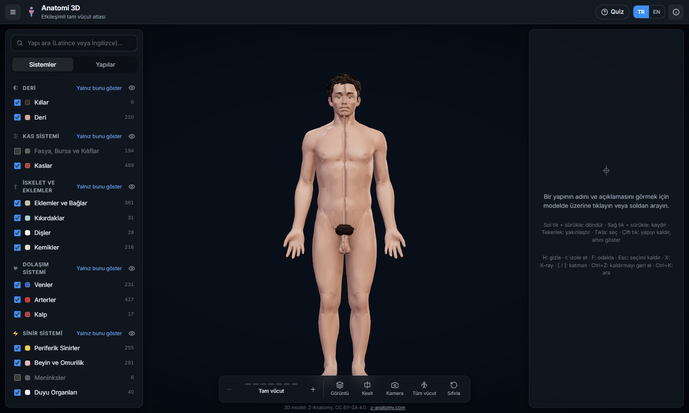<br><sub>Web sürümü ana ekranı.</sub></td>
<td width="50%">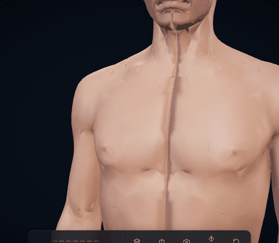<br><sub>Web sürümünde çift tıklayarak katman katman kazı.</sub></td>
</tr>
</table>

Web sürümünün model hattı `tools/build_za.mjs` (Z-Anatomy → `app/public/body/`), görselleri `tools/screenshots.mjs` ve `tools/make_gifs.py` ile üretilir.

## Yol haritası

- Beyin ve omurilik, periferik sinirler, arter ve venler, eklemler ve fasyalar için Türkçe bilgi girdileri
- Tüm içeriğin anatomi uzmanlarınca gözden geçirilmesi (`durum: onaylı`)
- Tümleşik ekran kartlarında performans ölçümü ve ince ayar
- İmzalı kurulum paketi

## Lisans ve kaynaklar

- **Kaynak kod ve Türkçe içerik** (`data/content/`): [MIT](LICENSE) © 2026 Muhammed Yusuf Adın
- **3D model, yapı adları ve açıklamalar** (`data/anatomy.pak`, `app/public/body/`): [Z-Anatomy](https://www.z-anatomy.com) (Lluís Vinent Juanico ve katkıda bulunanlar) verisinden türetilmiştir, **[CC BY-SA 4.0](https://creativecommons.org/licenses/by-sa/4.0/)** — ayrıntılar: [`data/LICENSE.md`](data/LICENSE.md). İngilizce açıklama metinleri Wikipedia kaynaklıdır (CC BY-SA).
- Üçüncü taraf bileşenler (Dear ImGui, Vortice.Windows, meshoptimizer vb.): [`THIRD-PARTY-NOTICES.md`](THIRD-PARTY-NOTICES.md)
- Bu uygulama eğitim amaçlıdır; tanı veya tedavi kararlarında kullanılmamalıdır.

---

<details>
<summary><b>English summary</b></summary>

**Anatomi 3D** is a professional, interactive full-body 3D anatomy atlas for Windows with ~2,950 structures (bones, muscles, joints & ligaments, arteries/veins, heart, nerves, brain & spinal cord, sense organs, viscera and skin regions), written in C# (.NET 8) with a custom Direct3D 11 renderer and a Dear ImGui interface.

- **Realistic real-time rendering**: PBR materials with clearcoat/sheen and a skin scattering approximation, shadows, SSAO, 4× MSAA, adaptive tessellation and procedural surface detail; 60 fps at 1080p on a GTX 1050.
- **Turkish-first content**: Turkish names for 99.9% of structures and a Turkish knowledge base (origin, insertion, innervation, blood supply, action and clinical notes) covering all bones and muscles and the main organ systems; Latin and English names; English Wikipedia descriptions.
- **Dissection tools**: double-click to remove structures, layer peeling, X-ray, wireframe, capped sections, isolation, muscle attachment areas, 23 region presets, search in Turkish/Latin/English, quiz mode.

Download the ready-to-run build from [Releases](https://github.com/EthYusuf/anatomi-3d/releases/latest). To build from source: install the .NET 8 SDK, run `tools\veri-indir.ps1` to fetch the model package, then `dotnet run --project src/Anatomi3D.Desktop -c Release`.

Code and Turkish content are MIT-licensed; the model data is derived from Z-Anatomy and licensed CC BY-SA 4.0. The original browser version (React + Three.js) lives in `app/`.

</details>
