<div align="center">

# Anatomi 3D

**Tarayıcıda çalışan, etkileşimli tam vücut 3D anatomi atlası**

~2.950 anatomik yapı · Türkçe / Latince / İngilizce adlar · katman katman diseksiyon · gerçekçi dokular


</div>

---

## İçindekiler

- [Öne çıkanlar](#öne-çıkanlar)
- [Nasıl çalışır — ekran görüntüleriyle](#nasıl-çalışır--ekran-görüntüleriyle)
- [Kurulum ve çalıştırma](#kurulum-ve-çalıştırma)
- [Kullanım ve kısayollar](#kullanım-ve-kısayollar)
- [Mimari](#mimari)
- [Model verisi hattı](#model-verisi-hattı)
- [Performans notları](#performans-notları)
- [Proje yapısı](#proje-yapısı)
- [Lisans ve kaynaklar](#lisans-ve-kaynaklar)

## Öne çıkanlar

| | |
|---|---|
| 🧍 **Tam vücut** | İskelet, kaslar, eklem ve bağlar, arter/ven, kalp, sinirler, beyin ve omurilik, duyu organları, iç organlar ve deri bölgeleri |
| 🔬 **Çift tıklayarak diseksiyon** | Bir yapıya çift tıklayın: tıkladığınız noktadan yayılan parlak kenarlı bir çözülmeyle kalkar, altındaki katman görünür (deri → kas → kemik). `Ctrl+Z` ile geri gelir |
| 🧬 **Gerçekçi yüzeyler** | Doku dosyası kullanmadan, shader içinde üretilen kas lifleri, kemik gözenekleri, deri dokusu, ıslak mukoza; prosedürel iris ve kılcal damarlı sklera |
| ❤️ **Canlı fizyoloji** | Kalp ~70/dk iki vuruşlu atar, akciğerler ~14/dk nefes alır |
| 🎬 **Sinematik geçişler** | Açılışta vücut ayaktan başa katman katman oluşur; katman soyma ve göster/gizle baştan ayağa taranan bir çizgiyle yapılır |
| 🇹🇷 **Türkçe öncelikli** | Arayüz Türkçe/İngilizce; yapılar Türkçe (sözlükte varsa), Latince (Terminologia Anatomica) ve İngilizce adlarıyla; Türkçe terimlerle arama ("kalp", "karaciğer") |
| 🧭 **İnceleme araçları** | Sistem ve kategori filtreleri, hiyerarşik yapı ağacı, izole etme, çevreyi saydamlaştırma, X-ray, tel kafes, üç eksende kesit, kamera ön ayarları |
| 🎓 **Quiz modu** | Görünen yapılar arasından rastgele soru; yanlış cevapta doğru yapı vurgulanır |
| 📱 **Mobil uyumlu** | Dokunmatik kontroller, alt çekmece paneller, çift dokunma ile kazı |

## Nasıl çalışır — ekran görüntüleriyle

### Açılış: vücut katman katman oluşur

Model yüklendikten sonra shader'lar arka planda derlenir, ardından önce iskelet, sonra organlar, damarlar, kaslar ve en son deri ayaktan başa doğru belirir.

<p align="center">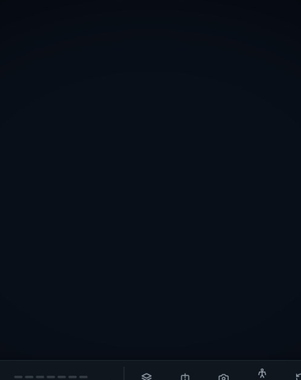</p>

### Çift tıklayarak diseksiyon

Her çift tıklama, tıklanan yapıyı o noktadan yayılan bir çözülmeyle kaldırır. Deri kalktığında iç yapılar yalnızca açılan "pencere"den görünür; derinin geri kalanı sağlam kalır. Üstteki çubuk kaldırılanları gösterir; **Geri al** / **Tümünü geri getir** ile yapılar aynı noktadan yeniden örülür.

<p align="center"></p>

<table>
<tr>
<td width="50%">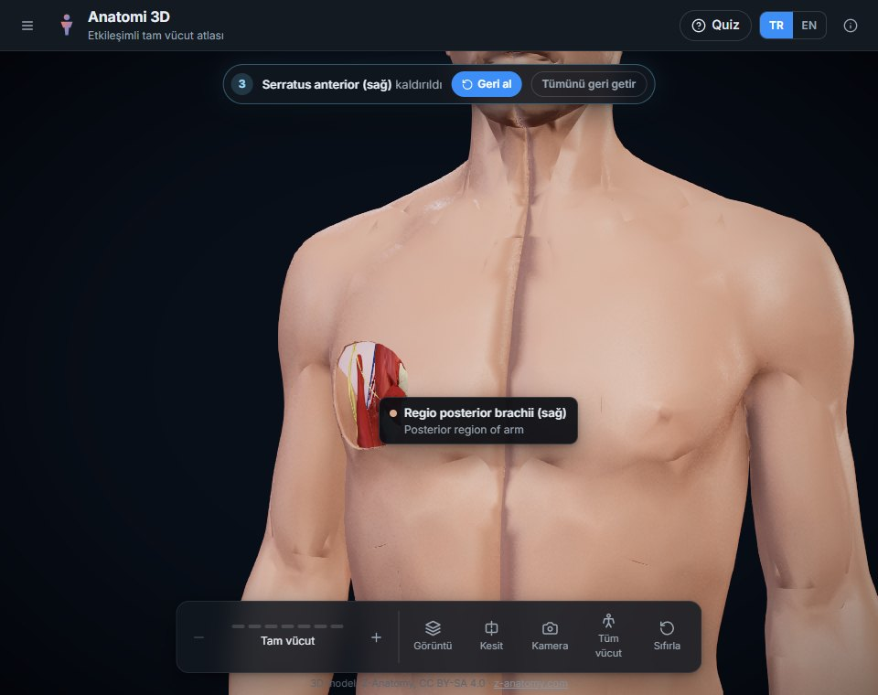<br><sub>Üç çift tıklamadan sonra: meme bölgesi derisi, büyük göğüs kası ve serratus anterior kaldırılmış.</sub></td>
<td width="50%">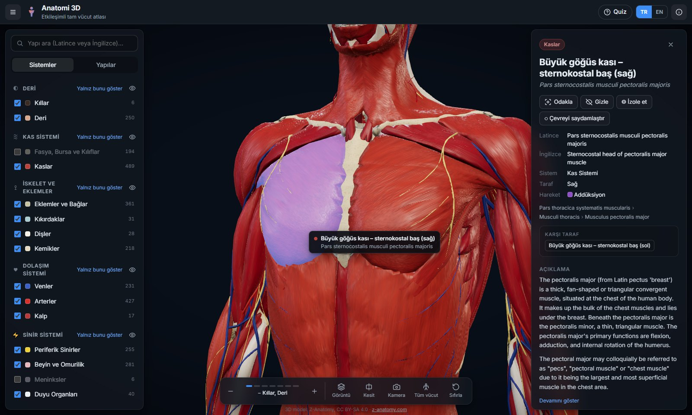<br><sub>Tek tıkla seçim: Türkçe / Latince / İngilizce ad, sistem, taraf, hareket (kas fonksiyonu), hiyerarşi, karşı taraf ve açıklama.</sub></td>
</tr>
</table>

### Gerçekçi dokular

<table>
<tr>
<td width="50%">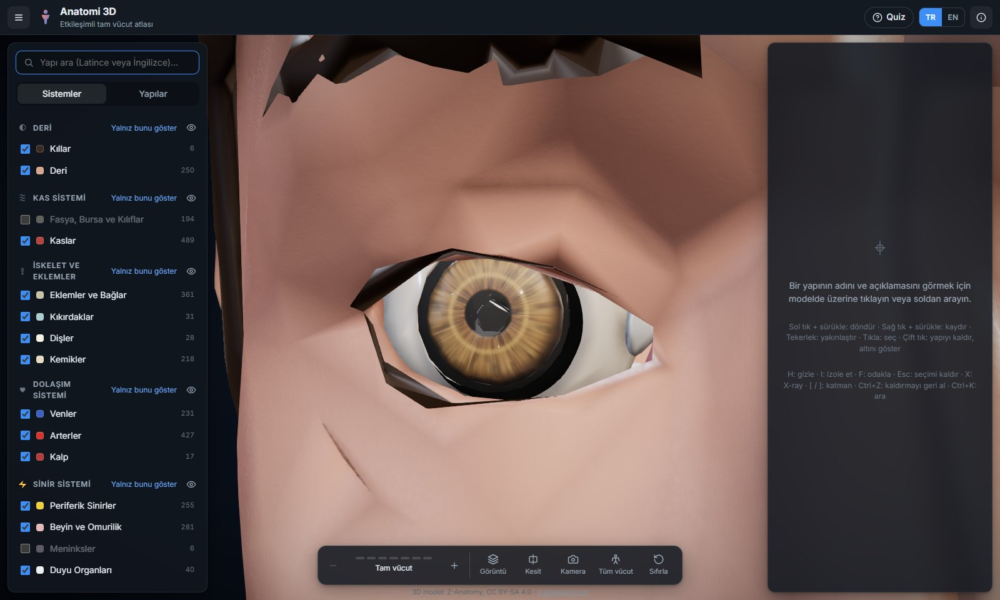<br><sub>Prosedürel iris (stroma lifleri, kriptler, kollaret), siyah göz bebeği, ince ve parlak kornea, limbus gölgesi.</sub></td>
<td width="50%">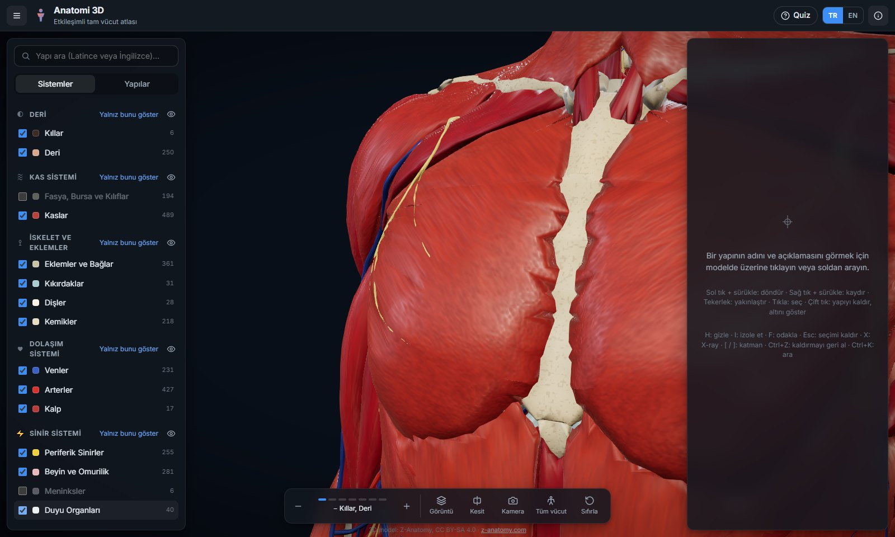<br><sub>Kas lifleri her kasın kendi ana ekseni boyunca uzanır; yüzey hafif ıslak ve parlak.</sub></td>
</tr>
<tr>
<td>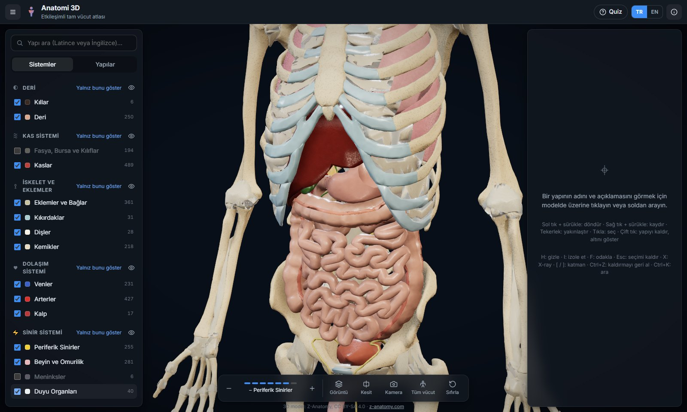<br><sub>Katman soyma ile iç organlar: karaciğer, mide, bağırsaklar; kıkırdaklar ve kemikler.</sub></td>
<td>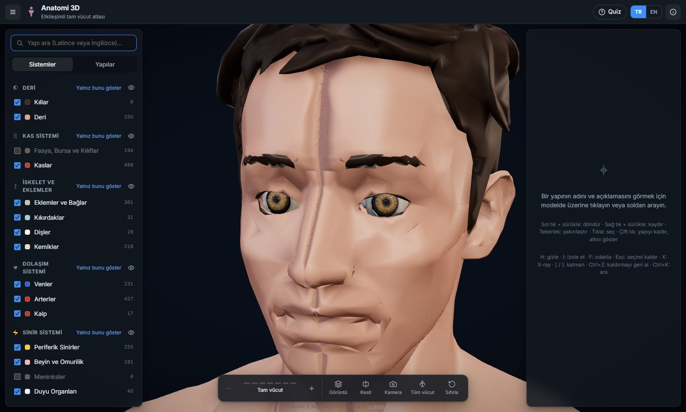<br><sub>Deri dokusu, kaşlar ve gözler.</sub></td>
</tr>
</table>

### İnceleme araçları

<table>
<tr>
<td width="50%">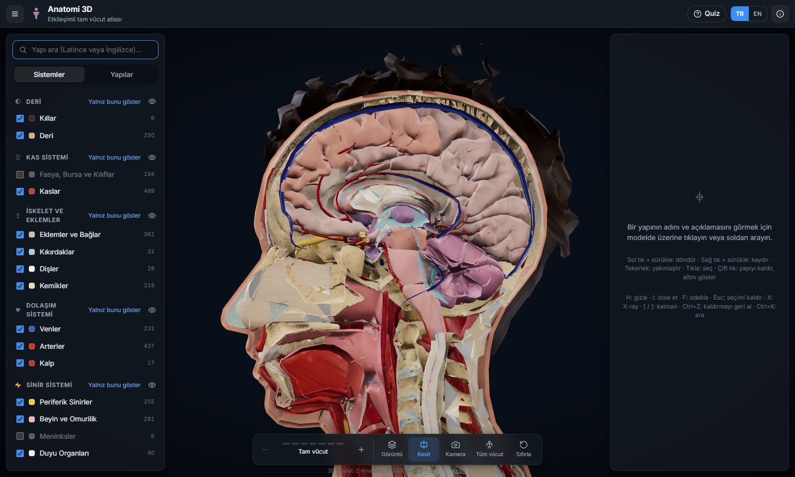<br><sub>Sagittal kesit: beyin, beyincik, omurilik, burun ve ağız boşluğu.</sub></td>
<td width="50%">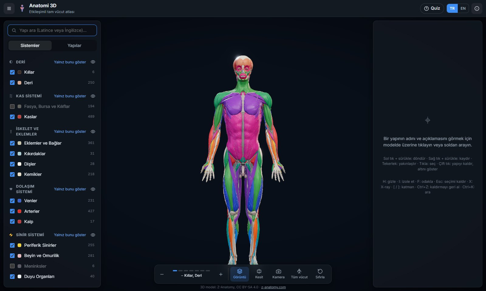<br><sub>Kas fonksiyonu renklendirmesi: fleksiyon, ekstansiyon, abdüksiyon, addüksiyon, rotasyon…</sub></td>
</tr>
<tr>
<td>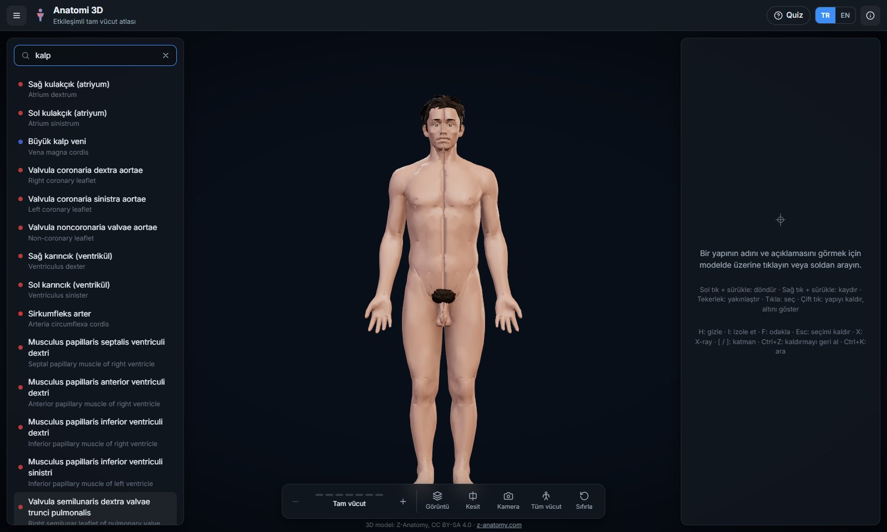<br><sub>Türkçe arama: "kalp" yazınca kulakçıklar, karıncıklar, kapakçıklar ve koroner damarlar listelenir.</sub></td>
<td>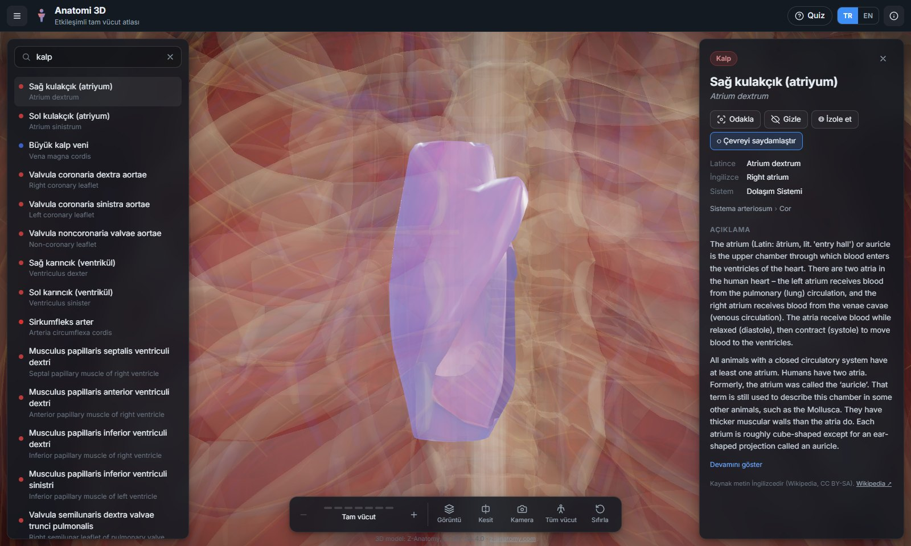<br><sub>Aramadan seçilen derin yapı otomatik odaklanır, çevresi saydamlaşır.</sub></td>
</tr>
<tr>
<td>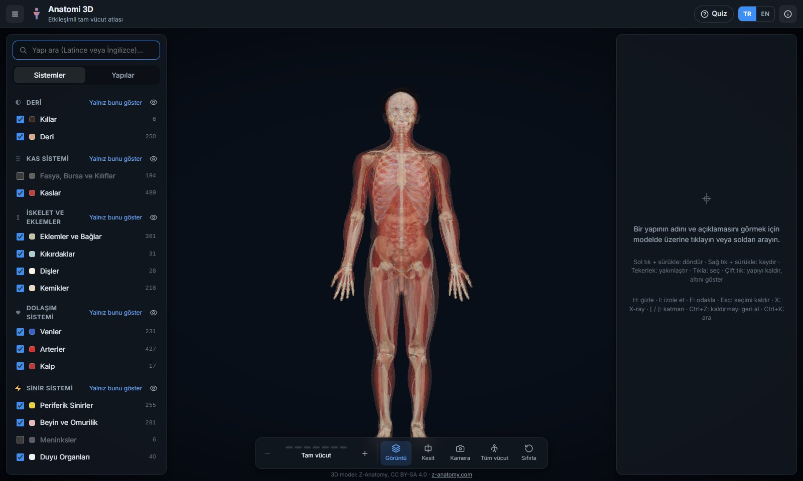<br><sub>X-ray modu.</sub></td>
<td>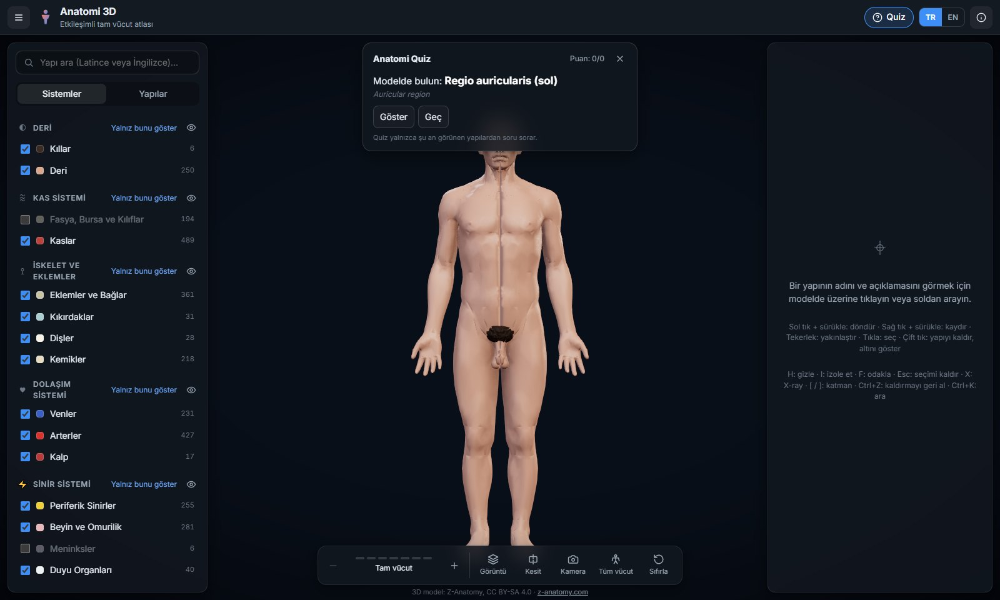<br><sub>Quiz modu: "Modelde bulun" soruları, puan ve seri.</sub></td>
</tr>
</table>

<p align="center">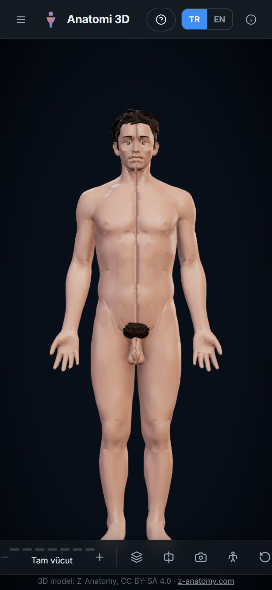<br><sub>Mobil görünüm</sub></p>

## Kurulum ve çalıştırma

Gereksinimler: **Node.js 20+** (geliştirmede 24 kullanıldı) ve WebGL2 destekli güncel bir tarayıcı.

```bash
git clone https://github.com/EthYusuf/anatomi-3d.git
cd anatomi-3d/app
npm install
npm run dev          # http://localhost:5173
```

Üretim derlemesi:

```bash
npm run build        # çıktı: app/dist/  (statik; herhangi bir statik sunucuda barındırılabilir)
npm run preview
```

> İşlenmiş model dosyaları (`app/public/body/`, ~5,4 MB GLB + açıklamalar) depoda hazır gelir; uygulamayı çalıştırmak için model hattını çalıştırmanız gerekmez.

## Kullanım ve kısayollar

| Eylem | Fare / dokunma | Klavye |
|---|---|---|
| Döndür / kaydır / yakınlaştır | Sol sürükle / sağ sürükle / tekerlek | — |
| Seç | Tıkla | `Esc` seçimi kaldırır |
| **Yapıyı kaldır (kazı)** | **Çift tıkla / çift dokun** | `Ctrl+Z` geri al · `Ctrl+Shift+Z` tümünü geri getir |
| Odakla | Bilgi panelinde **Odakla** | `F` |
| Gizle / izole et | Bilgi paneli | `H` / `I` |
| Katman soy / geri koy | Alt çubuktaki `−` `+` | `]` / `[` |
| X-ray | Görüntü menüsü | `X` |
| Ara | Sol panel | `Ctrl+K` |
| Tümünü göster | — | `U` |

**Görüntü** menüsünde görüntü kalitesi (*Gerçekçi* / *Hızlı*) ve canlı fizyoloji (kalp atışı, solunum) ayarlanabilir. Zayıf grafik işlemcilerde *Hızlı* modu önerilir.

## Mimari

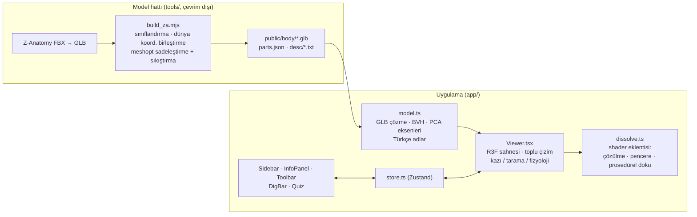

- **React 19 + React Three Fiber + drei**; durum yönetimi **Zustand**.
- **Seçim**: her yapı için `three-mesh-bvh` ile hızlandırılmış ışın izleme.
- **Toplu çizim**: sabit duran yapılar görünüm profiline göre `THREE.BatchedMesh` gruplarında çizilir (~2.500 çizim komutu → birkaç düzine). Seçilen, üzerine gelinen, çözülen veya animasyonlu yapılar otomatik olarak tekil çizime geçer.
- **Shader eklentisi** ([`dissolve.ts`](app/src/components/dissolve.ts)): standart PBR materyale `onBeforeCompile` ile eklenir:
  - *Çözülme*: tıklanan noktadan (kazı) ya da bir düzlem boyunca (katman soyma, açılış) ilerleyen gürültülü cephe ve parlak kenar.
  - *Deri penceresi*: deri kapalıyken iç yapılar yalnız deride açılan kürelerin içinde çizilir.
  - *Prosedürel yüzey*: dünya koordinatlı gürültü + ekran uzayı türevleriyle kabartma; beş aile (lif, kemik, deri, ıslak doku, göz), her biri ayrı küçük bir program.
- **Son işlem** (Gerçekçi kalite): N8AO ortam gölgelemesi, Bloom, ACES ton eşleme, vinyet, SMAA.

## Model verisi hattı

Uygulamanın kullandığı dosyalar depoda hazırdır. Yeniden üretmek isterseniz:

1. Z-Anatomy FBX modellerini [Z-Anatomy deposundan](https://github.com/LluisV/Z-Anatomy/tree/PC-Version/Resources/Models/FBX) indirip `fbx2gltf` ile GLB'ye çevirin ve `_raw/za/` altına koyun; çeviri ve açıklamalar için depodaki `Resources/` klasörünü `_raw/za_repo/Resources/` olarak ekleyin.
2. Modeli üretin:

```bash
cd tools
npm install
npm run build:model     # → app/public/body/
```

Betik etiket ve kas yapışma işaret düğümlerini ayıklar, her yapıyı dünya koordinatlarında tek mesh'e birleştirir, kategoriye göre hata eşiğiyle sadeleştirir (**8,2M → ~740K üçgen**), meshopt ile sıkıştırır (**~5,4 MB**) ve Latince adları, hiyerarşiyi ve açıklama eşleşmelerini `parts.json`'a yazar.

README görselleri de tekrar üretilebilir (geliştirme sunucusu `4173` portunda çalışırken):

```bash
cd tools
npm run screenshots     # docs/screenshots/*.jpg + animasyon kareleri
npm run gifs            # docs/*.gif
```

## Performans notları

Entegre bir GPU'da (Intel HD 630) ölçümler:

| Durum | FPS |
|---|---|
| Tam vücut (deri) | ~55–60 |
| Kas katmanı, yüksek kalite | ~25–30 |
| Kas katmanı, hızlı mod | ~35–40 |

- Deri tamamen opakken iç yapılar hiç çizilmez (hem hız hem de sadeleştirilmiş derinin altından taşma olmaması için).
- Shader'lar açılışta `compileAsync` ile paralel derlenir ve her karede bir program olacak şekilde ısıtılır; Windows'ta (ANGLE/D3D11) sürücü derlemesinin ana iş parçacığını uzun süre kilitlemesi böylece önlenir. İlk açılışta birkaç saniyelik "hazırlanıyor" ekranı normaldir.

## Proje yapısı

```
anatomi-3d/
├── app/                       # Web uygulaması (Vite + React + TypeScript)
│   ├── public/body/           # İşlenmiş model: kategori başına GLB, parts.json, açıklamalar (CC BY-SA 4.0)
│   └── src/
│       ├── components/        # Viewer, dissolve (shader), Sidebar, InfoPanel, Toolbar, DigBar, Quiz
│       ├── data/              # kategoriler, görünüm profilleri, Türkçe sözlük, arayüz metinleri
│       ├── model.ts           # model yükleme, BVH, eksenler
│       └── store.ts           # uygulama durumu
├── tools/                     # Model hattı ve geliştirme yardımcıları
│   ├── build_za.mjs           # Z-Anatomy → web modeli
│   ├── za_scan.mjs            # ham GLB düğüm taraması
│   ├── screenshots.mjs        # README ekran görüntüleri ve kareleri
│   ├── make_gifs.py           # karelerden GIF
│   ├── shot.mjs, probe.mjs    # görsel test ve açılış performans ölçümü
└── docs/                      # README görselleri
```

## Lisans ve kaynaklar

- **Kaynak kod**: [MIT](LICENSE) © 2026 Muhammed Yusuf Adın
- **3D model, yapı adları ve açıklamalar** (`app/public/body/`): [Z-Anatomy](https://www.z-anatomy.com) (Lluís Vinent Juanico ve katkıda bulunanlar) verisinden türetilmiştir, **[CC BY-SA 4.0](https://creativecommons.org/licenses/by-sa/4.0/)** — ayrıntılar: [`app/public/body/LICENSE.md`](app/public/body/LICENSE.md). Açıklama metinleri Wikipedia kaynaklıdır (CC BY-SA).
- Bu uygulama eğitim amaçlıdır; klinik karar için kullanılmamalıdır.

---

<details>
<summary><b>English summary</b></summary>

**Anatomi 3D** is an interactive, browser-based full-body 3D anatomy atlas with ~2,950 structures (bones, muscles, joints & ligaments, arteries/veins, heart, nerves, brain & spinal cord, sense organs, viscera and skin regions), built with React, React Three Fiber and Three.js.

- **Double-click dissection**: double-click any structure and it dissolves away from the clicked point, revealing the layer beneath (skin → muscle → bone); undo with `Ctrl+Z`.
- **Realistic procedural surfaces** (no textures): muscle fibres along each muscle's principal axis, porous bone, skin, wet mucosa, procedural iris and veined sclera; live heartbeat and breathing.
- Cinematic layer-by-layer intro, sweep transitions, X-ray, sections, isolation, search in Turkish/Latin/English, quiz mode, mobile support.
- Performance: `BatchedMesh` for static structures, BVH picking, async + progressive shader warm-up.

Run: `cd app && npm install && npm run dev`. Code is MIT-licensed; the model data is derived from Z-Anatomy and licensed CC BY-SA 4.0.

</details>
